# Art Hunter — AI-агент для коллекционера

Стажировочное задание Napoleon IT (Павел Подкорытов).
Исполнитель: Линар Мухамедьяров, 2026.

---

## Что делает

**Часть 1: Японский отчёт**
Агент ищет галереи и дилеров самурайского оружия и доспехов по трём городам маршрута (Киото → Фукуока → Токио). Работает с японскими источниками, переводит, проверяет данные, генерирует структурированный отчёт на русском.

**Часть 2: Мониторинг аукционов**
Ежедневный обход Sotheby's, Christie's, Bonhams, Phillips в поисках лотов целевых художников (Шульц, Айвазовский, старые мастера). Если находит — отправляет карточки лотов в Telegram через MCP-сервер. Если ничего нет — честно сообщает об этом.

---

## Видео демонстрации работы

https://drive.google.com/file/d/1Wa6uXr65DZBH3lDTpVw3wotQbna2B9oc/view?usp=sharing

---

## Архитектура

```mermaid
graph TD
    subgraph "Часть 1: Японский отчёт"
        A1[config/trip.json] --> B1[run.py]
        B1 --> C1[Haiku 4.5: поиск галерей Киото]
        B1 --> C2[Haiku 4.5: поиск галерей Фукуока]
        B1 --> C3[Haiku 4.5: поиск галерей Токио]
        C1 --> D1[Sonnet 4.6: валидация]
        C2 --> D1
        C3 --> D1
        D1 --> E1[Opus 4.7: финальный отчёт]
        E1 --> F1[output/japan_report.md]
    end

    subgraph "Часть 2: Мониторинг аукционов"
        A2[config/artists.json] --> B2[run_daily.py]
        B2 --> C4[Haiku 4.5: поиск лотов]
        C4 --> D2[Sonnet 4.6: фильтрация]
        D2 --> E2{lots?}
        E2 -->|нет| F2[Telegram: не найдено]
        E2 -->|да| G2[Opus 4.7: рекомендации]
        G2 --> H2[MCP Telegram Server]
        H2 --> I2[Telegram: карточки лотов]
    end

    subgraph "Инфраструктура"
        J1[cli.py: subprocess wrapper]
        J2[logs/calls_YYYYMMDD.jsonl]
        J3[mcp_telegram.py: JSON-RPC 2.0]
    end
```



---

## Структура проекта

```
art_hunter/
├── run.py                          # Часть 1: Японский отчёт
├── mcp_config.json                 # Конфиг MCP-сервера для Claude CLI
├── config/
│   ├── trip.json                   # Города, категории, даты маршрута
│   └── artists.json                # Целевые художники для мониторинга
├── prompts/                        # Промпты Части 1
│   ├── search.md
│   ├── validate.md
│   └── report.md
├── src/
│   └── cli.py                      # Subprocess-обёртка над Claude CLI
├── output/                         # Сгенерированные отчёты (.md)
├── logs/
│   └── calls_YYYYMMDD.jsonl        # Лог вызовов модели (Часть 1)
└── auction_monitor/
    ├── run_daily.py                 # Часть 2: ежедневный мониторинг
    ├── prompts/                     # Промпты Части 2
    │   ├── search_auctions.md
    │   ├── filter_lots.md
    │   └── recommend_lot.md
    ├── src/
    │   └── mcp_telegram.py         # MCP-сервер (JSON-RPC 2.0, stdio)
    └── logs/
        └── calls_YYYYMMDD.jsonl    # Лог вызовов модели (Часть 2)
```

---

## Как запустить

### Требования

- [Claude CLI](https://docs.claude.com/en/docs/claude-code/overview): `npm install -g @anthropic-ai/claude-code`
- Python 3.11+
- `pip install requests`
- Активная сессия Claude CLI: `claude` (один раз войти)

### Часть 1: Японский отчёт

1. Открыть `config/trip.json` и задать дату поездки:

```json
"date_range": {
    "start": "2026-06-15",
    "duration_days": 5
}
```

> Дата не вычисляется автоматически — нужно указать её вручную перед запуском.

2. Запустить:

```bash
python run.py
```

Отчёт сохраняется в `output/japan_galleries_YYYYMMDD_HHMMSS.md`.

### Часть 2: Мониторинг аукционов

1. Создать Telegram-бота через [@BotFather](https://t.me/BotFather), получить токен
2. Получить chat_id (написать боту `/start`, затем `https://api.telegram.org/bot<TOKEN>/getUpdates`)
3. Установить переменные окружения:

```bash
# Linux / macOS
export TELEGRAM_BOT_TOKEN=your_token_here
export TELEGRAM_CHAT_ID=your_chat_id_here

# Windows (PowerShell)
$env:TELEGRAM_BOT_TOKEN = "your_token_here"
$env:TELEGRAM_CHAT_ID   = "your_chat_id_here"
```

4. Запустить:

```bash
python auction_monitor/run_daily.py
```

Список художников для мониторинга — в `config/artists.json`.

### Расписание (опционально)

**Linux/macOS (cron):**
```bash
0 9 * * * cd /path/to/art_hunter && python auction_monitor/run_daily.py
```

**Windows (Task Scheduler):** создать задачу с триггером «Ежедневно» и командой `python auction_monitor/run_daily.py`.

---

## Выбор моделей

| Модель | Задача | Стоимость (прим.) |
|---|---|---|
| Haiku 4.5 | Поиск галерей/лотов через WebSearch | ~$0.01–0.02 |
| Sonnet 4.6 | Валидация данных, фильтрация лотов | ~$0.02–0.05 |
| Opus 4.7 | Финальный отчёт, экспертные рекомендации | ~$0.05–0.15 |

**Почему так:**
- Разделение моделей экономит до 60% бюджета по сравнению с Opus везде
- Haiku в 10× дешевле Opus — используем для массового поиска, где качество не критично
- Opus только на финале: когда нужны реальные рассуждения и качество текста

---

## MCP-сервер

Самописный MCP-сервер (`auction_monitor/src/mcp_telegram.py`) на JSON-RPC 2.0 через stdio.
Claude CLI запускает его как subprocess через `--mcp-config mcp_config.json`.

Инструмент: `send_telegram_message(chat_id: str, text: str)`.

Методы: `initialize`, `tools/list`, `tools/call`, `ping`.

`strip_markdown()` очищает текст перед отправкой: убирает `**жирный**`, `### заголовки`, `[ссылки](url)` → `ссылки (url)`.

---

## Логирование

Каждый вызов модели записывается в JSONL:

```json
{
  "timestamp": "2026-05-10T17:34:15.123",
  "step": "search_lots",
  "model": "claude-haiku-4-5-20251001",
  "duration_ms": 48200,
  "cost_usd": 0.0012,
  "usage": {"input_tokens": 1200, "output_tokens": 800},
  "prompt_preview": "Find upcoming auction lots...",
  "response_preview": "## Upcoming 2026 Auction Lots..."
}
```

---

## Автор

Линар Мухамедьяров — стажировочное задание Napoleon IT, 2026.
